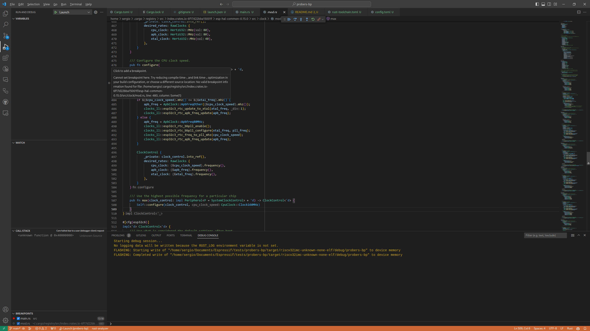

## Debugging error in `probe-rs` reproduction example

While using `probe-rs`, I encountered the following error message when setting a breakpoint using the probe-rs VS Code extension:

If I set a breakpoint in `main.rs` it works well. But when "stepping into" a few times, I cant "step into" anymore. Example:
1. Set breakpoint in `main.rs:13`
2. Start the "Launch" debugging configuration
3. Continue - F5
    - Program will stop in the `main.rs:13` breakpoint
4. Step Into - F11
    - Program will stop in the `ClockControl::max` method
6. Step Over - F10
    -  Program will stop in the call of `Self::configure` call `ClockControl::max` method
7. Step Into - F11
    - This step into is ignored.
